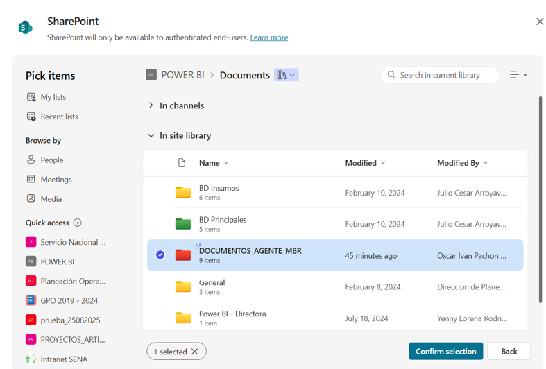
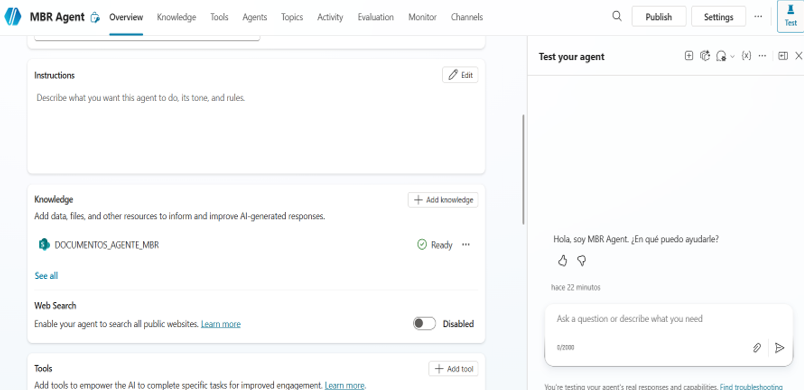
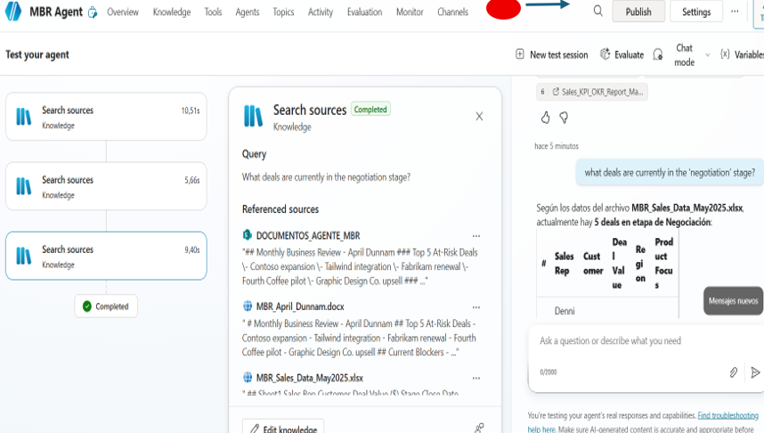
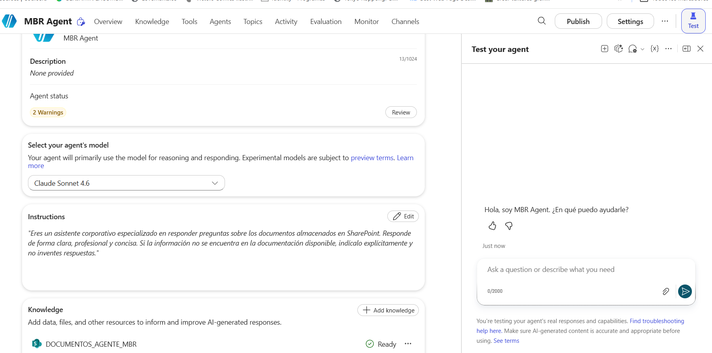

# Screenshots

This folder contains screenshots documenting the implementation of the MBR Agent using Microsoft Copilot Studio and SharePoint.

## Implementation Overview

The screenshots document the main stages of the solution, from preparing the enterprise knowledge source to testing the grounded responses generated by the agent.

### 01. SharePoint MBR Documents

The MBR source documents are stored in the `DOCUMENTOS_AGENTE_MBR` SharePoint folder.

---

### 02. MBR Agent Knowledge Configuration

The MBR Agent is configured in Microsoft Copilot Studio with the SharePoint folder connected as a knowledge source.

---

### 03. Grounded Agent Response

The agent searches the configured knowledge source and identifies referenced documents before generating the response.

---

### 04. Agent Model and Instructions

The agent configuration includes the selected language model, behavioral instructions and SharePoint knowledge source.

